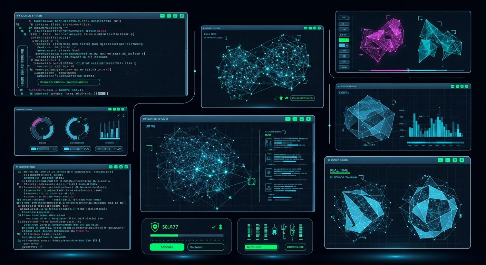

# 🌐 Cyberpunk Developer Portfolio


> *Un portafolio interactivo de alto rendimiento con estética Cyberpunk, construido para el futuro.*

Este proyecto es una aplicación web full-stack diseñada para mostrar habilidades, proyectos y experiencia con una interfaz de usuario inmersiva y futurista. Combina animaciones fluidas, diseño responsivo y una arquitectura robusta.

## ✨ Características

- **🎨 Estética Cyberpunk**: Interfaz de usuario temática con efectos de glitch, scanlines y paleta de colores neón.
- **⚡ Rendimiento Ultra-rápido**: Impulsado por Vite y React para una experiencia de usuario instantánea.
- **📱 Diseño Responsivo**: Adaptable a cualquier dispositivo, desde móviles hasta pantallas de escritorio de alta resolución.
- **🚀 Animaciones Avanzadas**: Integración de `framer-motion` para transiciones suaves y efectos visuales impactantes.
- **🛠️ Backend Robusto**: API RESTful construida con Express y TypeScript.
- **🗄️ Gestión de Datos**: Integración con PostgreSQL utilizando Drizzle ORM para un manejo de datos eficiente y seguro.

## 📸 Capturas de Pantalla

¡Aquí es donde puedes mostrar tu proyecto!

| Security Dashboard | DevOps Pipeline |
|:------------------:|:---------------:|
|  |  |
| *Monitorización de amenazas en tiempo real* | *Automatización de CI/CD* |

| Pentesting Tool | Hero Section |
|:---------------:|:------------:|
|  |  |
| *Framework de pruebas de penetración* | *Vista principal inmersiva* |

## 🛠️ Stack Tecnológico

Este proyecto ha sido construido utilizando las tecnologías más modernas del ecosistema web:

### Frontend
- **React 18**: Biblioteca para construir interfaces de usuario.
- **TypeScript**: Tipado estático para un código más seguro y mantenible.
- **Tailwind CSS**: Framework de utilidad para estilos rápidos y personalizados.
- **Framer Motion**: Biblioteca de animaciones para React.
- **Radix UI / Shadcn UI**: Componentes accesibles y personalizables.
- **Wouter**: Enrutamiento minimalista para React.

### Backend
- **Node.js & Express**: Servidor rápido y ligero.
- **Drizzle ORM**: ORM moderno para TypeScript y SQL.
- **PostgreSQL**: Base de datos relacional potente.

### DevOps & Herramientas
- **Vite**: Herramienta de construcción de frontend de próxima generación.
- **Docker**: Contenerización para un despliegue consistente.

## 🚀 Instalación y Uso

Sigue estos pasos para ejecutar el proyecto localmente:

### Prerrequisitos
- Node.js (v20 o superior)
- npm o yarn
- Docker (opcional, para base de datos)

### Pasos

1.  **Clonar el repositorio**
    ```bash
    git clone https://github.com/tu-usuario/DevOps_Cyber_Punk.git
    cd DevOps_Cyber_Punk
    ```

2.  **Instalar dependencias**
    ```bash
    npm install
    ```

3.  **Configurar variables de entorno**
    Crea un archivo `.env` en la raíz y configura tus credenciales de base de datos (si es necesario).

4.  **Ejecutar en modo desarrollo**
    ```bash
    npm run dev
    ```
    La aplicación estará disponible en `http://localhost:5000`.

5.  **Construir para producción**
    ```bash
    npm run build
    npm start
    ```

## 🤖 Créditos de IA

Este proyecto fue **codificado y asistido por GitHub Copilot**, utilizando modelos de IA avanzados para generar código eficiente, limpio y moderno.

---

Hecho con 💜 y 🦾 código para Yim.
and Don't forget, just codig 4 fun !!!